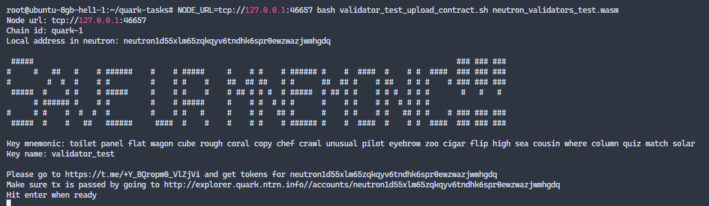
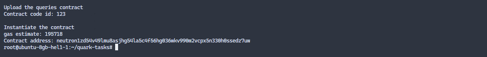

# Инструкции валидатора Quark Testnet (ICA, ICQ)

## Обзор

Этот документ содержит описание тестовых примеров ICA и ICQ для тестовой сети Quark: Тесты ICA связаны с выполнением множества межцепочечных транзакций, а тесты ICQ связаны с регистрацией множества межцепочечных запросов и проверкой того, что ответы на эти запросы были отправлены. Оба тестовых случая ICA и ICQ требуют развертывания смарт-контракта на цепочке Neutron, запуска ретранслятора (IBC и ICQ соответственно) и взаимодействия с развернутыми контрактами.

Примечание

Чтобы облегчить всем жизнь, команда Neutron подготовила специальный [smart contract](https://github.com/neutron-org/neutron-contracts/tree/neutron_audit_oak_19_09_2022_fixes/contracts/neutron_validator_test) для тестовых случаев, а также несколько сценариев тестирования ([1](https://github.com/neutron-org/neutron-contracts/blob/neutron_audit_oak_19_09_2022_fixes/validator_test_upload_contract.sh), [2](https://github.com/neutron-org/neutron-contracts/blob/neutron_audit_oak_19_09_2022_fixes/validator_test.sh)) которые помогут вам пройти все шаги, описанные в тестовых примерах. Это означает, что в конечном итоге все, что вам нужно сделать, это:

1. [Установка ноды](#get-the-neutrond-binary);
2. [Загрузка тестового контракта](#uploading-the-test-contract);
3. [Установка двух релейеров](#setting-up-the-relayers);
4. [Запуск скрипта тестирования](#running-the-tasks);
5. Собранные результаты отправить через [форму](https://forms.gle/cyEdWfFTygkvcLEQ7).

## Подготовка

Ни один из сценариев тестирования не устанавливает ретрансляторы IBC и ICQ. Вам необходимо настроить IBC и ICQ ретрансляторы перед выполнением скриптов. Для этого вам нужно иметь несколько токенов testnet как на Neutron, так и на целевой сети по вашему выбору (у нас есть инструкции для Cosmos hub и Juno).

### Получаем бинарник `neutrond`

Смотрите [инструкции](https://github.com/neutron-org/testnets/blob/main/quark/README.md#node-installation), или загрузите бинарник со страницы [releases](https://github.com/neutron-org/neutron/releases/latest).

### Генерируем адреса релейеров на Neutron и получаем тестовые `$ntrn` токены

Токены Neutron testnet необходимы для работы релейеров IBC и ICQ. 

**Адреса, сгенерированные в этом разделе будут использованы в конфигурации [Hermes](#ibc-relayer) и [ICQ Relayer](#icq-relayer-setup) в качестве адреса на чейне Neutron.**

1. Генерируем ключи с помощью следующих команд:
   
    `neutrond keys add ibc-relayer`
    
    `neutrond keys add icq-relayer`

    и сохраняем мнемоники;

2. Идем в [Faucet](http://faucet.quark.ntrn.info/) и получаем токены на сгенерированные выше адреса;
3. Убеждаемся что транза прошла на Neutron testnet explorer: http://explorer.quark.ntrn.info/accounts/<your_relayer_address>.

### Получаем тестовые токены на таргет чейне

Токены Testnet необходимы для работы IBC-релея. **Вы укажете адрес, используемый в этом разделе в конфигурации [Hermes](#ibc-relayer), как адрес в таргет чейне по вашему выбору.**.

> ВНИМАНИЕ: следующие руководства по получению токенов testnet содержат посещение сайта https://jsfiddle.net/. Этот ресурс может быть недоступен из вашего местоположения без VPN.

#### Cosmos hub

Если у вас нет `atom`, то вы можете выполнить следующие шаги:

- Если нет Keplr [ставим](https://www.keplr.app/);
- Если отсутствует сеть CosmosHub testnet в Keplr, идем на [Jsfiddle](https://jsfiddle.net/kht96uvo/1/), и добавляем сеть `theta-testnet-001` в Keplr;
- Для простоты, можно повторно использовать мнемонику от ключа `ibc-relayer` (Keplr -> Add Account -> Import existing account);
- Идем в канал [Faucet](https://discord.com/channels/669268347736686612/953697793476821092) в Discord получаем `atom` (сначала добавляемся на сервер: https://discord.gg/cosmosnetwork).

#### Juno

Если у вас нет `junox` то вы можете выполнить следующие шаги:

- Если нет Keplr [ставим](https://www.keplr.app/);
- Если отсутствует сеть Juno testnet в Keplr, идем на [Jsfiddle](https://jsfiddle.net/superatik/L6bys84z/1/), и добавляем сеть `uni-5` в Keplr;
- Для простоты, можно повторно использовать мнемонику от ключа `ibc-relayer` (Keplr -> Add Account -> Import existing account);
- Идем в [Faucet](https://faucet.roguenet.io/) и получаем `junox`.

### Загрузка тестового контракта

Вам необходимо знать адрес тестового контракта, чтобы правильно настроить ретрансляторы ICA и ICQ (чтобы они обрабатывали только сообщения, относящиеся к этому конкретному контракту). Для этого:

1. Загружаем [скрипт](https://github.com/neutron-org/neutron-contracts/blob/neutron_audit_oak_19_09_2022_fixes/validator_test_upload_contract.sh) инициализации контракта на сервер;
2. Загружаем [артефакт](https://github.com/neutron-org/neutron-contracts/raw/neutron_audit_oak_19_09_2022_fixes/artifacts/neutron_validators_test.wasm) тестового контракта на сервер.

После того как скрипт и артефакт загружены, выполняем скрипт (`NODE_URL` задает переменную с адресом ноды; Не забываем про `tcp://` префикс (!), в моем случае нейтрон на локале `tcp://127.0.0.1:46657`)

```
$ NODE_URL=tcp://<your_node_host:port> bash validator_test_upload_contract.sh neutron_validators_test.wasm
```
Этот скрипт:
* Создает адрес `tmp`;
* Предлагает получить `$ntrn` токены из крана;
* Загружает код контракта на адрес `tmp`;
* Инициализирует контракт.

В этом примере <test_contract_address> сохраняется в `./contract_address.tmp`.

Ниже показан пример выполнения скрипта. Генерация адреса:



После генерации получаем токены на сгенерированный адрес через фасет, проверяем баланс в експлорере, и нажимаем enter:



Записываем весь вывод (!)

### Setting up the relayers

#### IBC relayer

See the [instruction](https://github.com/neutron-org/testnets/blob/main/quark/ibc-relayer/instruction.md).

> Note: you should first start the relayer **without** specifying [the channel](https://github.com/neutron-org/testnets/blob/main/quark/ibc-relayer/config.toml#L163-L165) that the relayer will work with using the contract address from the previous step. You can add this config and restart the relayer **after** running the [testing script](https://github.com/neutron-org/neutron-contracts/blob/neutron_audit_oak_19_09_2022_fixes/validator_test.sh) (see below) to make `hermes` only relay packets that are produced by your test contract. See the [documentation](https://docs.neutron.org/neutron/interchain-txs/overview#relaying) for more information.

> Note: you will need the `connection_id` on Neutron (`a_side`) from this step later.

> Note: you will need the mnemonic of `ibc-relayer` key from the [keys generation](#generate-the-relayers-address-on-neutron-and-get-testnet-ntrn-tokens) step both for `NEUTRON_MNEMONIC` and `TARGET_CHAIN_MNEMONIC` parameters.

#### ICQ relayer setup 

See the [instruction](https://github.com/neutron-org/testnets/blob/main/quark/icq-relayer/README.md).

> Note: don't forget to specify the contract address that the relayer will work with using the contract address from the [previous step](#uploading-the-test-contract). See the [documentation](https://docs.neutron.org/relaying/icq-relayer#relayer-application-settings) for more information. The configuration option you are looking for is `RELAYER_REGISTRY_ADDRESSES`.

> Note: you will need the mnemonic of `icq-relayer` key from the [keys generation](#generate-the-relayers-address-on-neutron-and-get-testnet-ntrn-tokens) step.

## Test cases (informational)

This section contains the desciption of the ICA and ICQ test cases. The *single* testing [script](https://github.com/neutron-org/neutron-contracts/blob/neutron_audit_oak_19_09_2022_fixes/validator_test.sh) goes through all the steps in both the ICA and ICQ test cases, which you can check by reading the script. 

> **Note: this section simply provides you with the description of the tasks, no actions are required here. You will go through all the steps in the next section by running the test script.**

### ICA

1. Upload the testing contract [artifact](https://github.com/neutron-org/neutron-contracts/blob/neutron_audit_oak_19_09_2022_fixes/artifacts/neutron_validators_test.wasm),
2. Execute an interchain transaction (send a [message](https://github.com/neutron-org/neutron-contracts/blob/0ba9a36c6d26166cc7051436ec21417031de1334/contracts/neutron_validator_test/src/msg.rs#L39-L45) to the contract) that should return a successful ACK, share the tx links,
3. Execute an interchain transaction (send a [message](https://github.com/neutron-org/neutron-contracts/blob/0ba9a36c6d26166cc7051436ec21417031de1334/contracts/neutron_validator_test/src/msg.rs#L39-L45) to the contract) that should return an error ACK, share the tx links,
4. Execute an interchain transaction (send a [message](https://github.com/neutron-org/neutron-contracts/blob/0ba9a36c6d26166cc7051436ec21417031de1334/contracts/neutron_validator_test/src/msg.rs#L39-L45) to the contract) that should return a successful ACK that will be processed by the contract with an error, share the tx links.

> Note: when the ICA module executes an interchain transaction on the host chain, an IBC acknowledgement packet gets sent to the controller chain. This acknowledgement can either be a successful acknowledgement or an error acknowledgement. 

### ICQ

1. Upload the testing contract [artifact](https://github.com/neutron-org/neutron-contracts/blob/neutron_audit_oak_19_09_2022_fixes/artifacts/neutron_validators_test.wasm),
2. Register a tx query (send a [message](https://github.com/neutron-org/neutron-contracts/blob/0ba9a36c6d26166cc7051436ec21417031de1334/contracts/neutron_validator_test/src/msg.rs#L66-L71) to the contract), and share tx hash,
3. Register a kv query (send a [message](https://github.com/neutron-org/neutron-contracts/blob/0ba9a36c6d26166cc7051436ec21417031de1334/contracts/neutron_validator_test/src/msg.rs#L60-L65) to the contract), and share tx hash,
4. Wait until the relayer submits the responses, share the txs in a Google form,
5. Control contract address balance during query registration to register balance reduction for deposit (please read the [documentation](https://docs.neutron.org/neutron/interchain-queries/overview#query-creation-deposit) on deposits),
6. Delete **the tx query** (send a [message](https://github.com/neutron-org/neutron-contracts/blob/0ba9a36c6d26166cc7051436ec21417031de1334/contracts/neutron_validator_test/src/msg.rs#L72-L74) to the contract) before the query submit timeout event, to collect the deposit to contract address.

## Running the tasks

### Test

1. Upload the [testing script](https://github.com/neutron-org/neutron-contracts/blob/neutron_audit_oak_19_09_2022_fixes/validator_test.sh) to your node,
2. Run this script on your server (`YOUR_CONNECTION_ID` is the connection identifier (Neutron side) that you saved after running the IBC relayer): 

`NODE_URL=tcp://<your_node_host:port> bash validator_test.sh YOUR_CONNECTION_ID`


3. Follow the script instructions,
4. Collect the output and paste in to the results [submission form](https://forms.gle/cyEdWfFTygkvcLEQ7),
5. **PLEASE DON'T FORGET TO SAVE ALL SCRIPT OUTPUT IN A SEPARATE FILE; IT MIGHT BE REQUIRED FOR DEBUGGING.**

> NOTE: when prompted for a passphrase, use the same passphrase you used when uploading the test contract.

> NOTE: if you see the message `Please send 0.02 atom to cosmosXXXXXXXXXXXX`, use the Keplr wallet to send the required amount to that address. You can check the delivery using a block explorer, e.g., https://explorer.theta-testnet.polypore.xyz/accounts/cosmos1c5gl8epk99jvz23dhnyp5et9rmm8wdq89v9hqnvt0pr74j5d2s7sjjxlp7

In case of errors, contact the dev team on [Discord](https://discord.com/channels/986573321023942708/1030044052529352724) or [Telegram](https://t.me/neutron_community).

