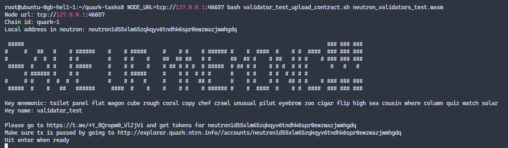
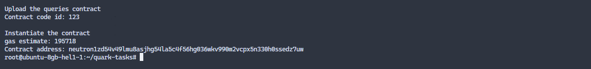

# Инструкции валидатора Quark Testnet (ICA, ICQ)

## Обзор

Этот документ содержит описание тестовых примеров ICA и ICQ для тестовой сети Quark: Тесты ICA связаны с выполнением множества межцепочечных транзакций, а тесты ICQ связаны с регистрацией множества межцепочечных запросов и проверкой того, что ответы на эти запросы были отправлены. Оба тестовых случая ICA и ICQ требуют развертывания смарт-контракта на цепочке Neutron, запуска ретранслятора (IBC и ICQ соответственно) и взаимодействия с развернутыми контрактами.

Примечание

Чтобы облегчить всем жизнь, команда Neutron подготовила специальный [smart contract](https://github.com/neutron-org/neutron-contracts/tree/neutron_audit_oak_19_09_2022_fixes/contracts/neutron_validator_test) для тестовых случаев, а также несколько сценариев тестирования ([1](https://github.com/neutron-org/neutron-contracts/blob/neutron_audit_oak_19_09_2022_fixes/validator_test_upload_contract.sh), [2](https://github.com/neutron-org/neutron-contracts/blob/neutron_audit_oak_19_09_2022_fixes/validator_test.sh)) которые помогут вам пройти все шаги, описанные в тестовых примерах. Это означает, что в конечном итоге все, что вам нужно сделать, это:

1. [Установка ноды](#get-the-neutrond-binary);
2. [Загрузка тестового контракта](#uploading-the-test-contract);
3. [Установка двух релейеров](#setting-up-the-relayers);
4. [Запуск скрипта тестирования](#running-the-tasks);
5. Собранные результаты отправить через [форму](https://forms.gle/cyEdWfFTygkvcLEQ7).

## Подготовка

Ни один из сценариев тестирования не устанавливает ретрансляторы IBC и ICQ. Вам необходимо настроить IBC и ICQ ретрансляторы перед выполнением скриптов. Для этого вам нужно иметь несколько токенов testnet как на Neutron, так и на целевой сети по вашему выбору (у нас есть инструкции для Cosmos hub и Juno).

### Получаем бинарник `neutrond`

Смотрите [инструкции](https://github.com/neutron-org/testnets/blob/main/quark/README.md#node-installation), или загрузите бинарник со страницы [releases](https://github.com/neutron-org/neutron/releases/latest).

### Генерируем адреса релейеров на Neutron и получаем тестовые `$ntrn` токены

Токены Neutron testnet необходимы для работы релейеров IBC и ICQ. 

**Адреса, сгенерированные в этом разделе будут использованы в конфигурации [Hermes](#ibc-relayer) и [ICQ Relayer](#icq-relayer-setup) в качестве адреса на чейне Neutron.**

1. Генерируем ключи с помощью следующих команд:
   
    `neutrond keys add ibc-relayer`
    
    `neutrond keys add icq-relayer`

    и сохраняем мнемоники;

2. Идем в [Faucet](http://faucet.quark.ntrn.info/) и получаем токены на сгенерированные выше адреса;
3. Убеждаемся что транза прошла на Neutron testnet explorer: http://explorer.quark.ntrn.info/accounts/<your_relayer_address>.

### Получаем тестовые токены на таргет чейне

Токены Testnet необходимы для работы IBC-релея. **Вы укажете адрес, используемый в этом разделе в конфигурации [Hermes](#ibc-relayer), как адрес в таргет чейне по вашему выбору.**.

> ВНИМАНИЕ: следующие руководства по получению токенов testnet содержат посещение сайта https://jsfiddle.net/. Этот ресурс может быть недоступен из вашего местоположения без VPN.

#### Cosmos hub

Если у вас нет `atom`, то вы можете выполнить следующие шаги:

- Если нет Keplr [ставим](https://www.keplr.app/);
- Если отсутствует сеть CosmosHub testnet в Keplr, идем на [Jsfiddle](https://jsfiddle.net/kht96uvo/1/), и добавляем сеть `theta-testnet-001` в Keplr;
- Для простоты, можно повторно использовать мнемонику от ключа `ibc-relayer` (Keplr -> Add Account -> Import existing account);
- Идем в канал [Faucet](https://discord.com/channels/669268347736686612/953697793476821092) в Discord получаем `atom` (сначала добавляемся на сервер: https://discord.gg/cosmosnetwork).

#### Juno

Если у вас нет `junox` то вы можете выполнить следующие шаги:

- Если нет Keplr [ставим](https://www.keplr.app/);
- Если отсутствует сеть Juno testnet в Keplr, идем на [Jsfiddle](https://jsfiddle.net/superatik/L6bys84z/1/), и добавляем сеть `uni-5` в Keplr;
- Для простоты, можно повторно использовать мнемонику от ключа `ibc-relayer` (Keplr -> Add Account -> Import existing account);
- Идем в [Faucet](https://faucet.roguenet.io/) и получаем `junox`.

### Загрузка тестового контракта

Вам необходимо знать адрес тестового контракта, чтобы правильно настроить ретрансляторы ICA и ICQ (чтобы они обрабатывали только сообщения, относящиеся к этому конкретному контракту). Для этого:

1. Загружаем [скрипт](https://github.com/neutron-org/neutron-contracts/blob/neutron_audit_oak_19_09_2022_fixes/validator_test_upload_contract.sh) инициализации контракта на сервер;

```
wget https://raw.githubusercontent.com/neutron-org/neutron-contracts/neutron_audit_oak_19_09_2022_fixes/validator_test_upload_contract.sh
```

2. Загружаем [артефакт](https://github.com/neutron-org/neutron-contracts/raw/neutron_audit_oak_19_09_2022_fixes/artifacts/neutron_validators_test.wasm) тестового контракта на сервер.

```
wget https://github.com/neutron-org/neutron-contracts/raw/neutron_audit_oak_19_09_2022_fixes/artifacts/neutron_validators_test.wasm
```

После того как скрипт и артефакт загружены, выполняем скрипт (`NODE_URL` задает переменную с адресом ноды; Не забываем про `tcp://` префикс (!), в моем случае нейтрон на локале `tcp://127.0.0.1:46657`, ставим свои значения (!!))

```
$ NODE_URL=tcp://<your_node_host:port> bash validator_test_upload_contract.sh neutron_validators_test.wasm
```
Этот скрипт:
* Создает адрес `tmp`;
* Предлагает получить `$ntrn` токены из крана;
* Загружает код контракта на адрес `tmp`;
* Инициализирует контракт.

В этом примере <test_contract_address> сохраняется в `./contract_address.tmp`.

Ниже показан пример выполнения скрипта. Генерация адреса:



После генерации получаем токены на сгенерированный адрес через фасет, проверяем баланс в експлорере, и нажимаем enter:



Записываем весь вывод (!)

### Установка релейеров

#### IBC relayer

Смотрим [инструкцию](https://github.com/neutron-org/testnets/blob/main/quark/ibc-relayer/instruction.md).

> Примечание: сначала вы должны запустить ретранслятор **без** указания [канала](https://github.com/neutron-org/testnets/blob/main/quark/ibc-relayer/config.toml#L163-L165), с которым будет работать ретранслятор, используя адрес контракта из предыдущего шага. Вы можете добавить этот конфиг и перезапустить ретранслятор **после** выполнения [скрипта тестирования](https://github.com/neutron-org/neutron-contracts/blob/neutron_audit_oak_19_09_2022_fixes/validator_test.sh) (см. ниже), чтобы заставить `hermes` ретранслировать только пакеты, созданные вашим тестовым контрактом. Более подробную информацию смотрите в [документации](https://docs.neutron.org/neutron/interchain-txs/overview#relaying).

> Примечание: вам понадобится `connection_id` на Neutron (`a_side`) из этого шага позже.

> Примечание: вам понадобится мнемоника ключа `ibc-relayer` из шага [генерация ключей](#generate-the-relayers-address-on-neutron-and-get-testnet-ntrn-tokens) как для параметров `NEUTRON_MNEMONIC`, так и для `TARGET_CHAIN_MNEMONIC`.

#### ICQ relayer

См. [инструкцию](https://github.com/neutron-org/testnets/blob/main/quark/icq-relayer/README.md).

> Примечание: не забудьте указать адрес контракта, с которым будет работать ретранслятор, используя адрес контракта из [предыдущего шага](#uploading-the-test-contract). Дополнительную информацию см. в [документации](https://docs.neutron.org/relaying/icq-relayer#relayer-application-settings). Искомый параметр конфигурации - `RELAYER_REGISTRY_ADDRESSES`.

> Примечание: вам понадобится мнемоника ключа `icq-relayer` из шага [генерация ключей](#generate-the-relayers-address-on-neutron-and-get-testnet-ntrn-tokens).


## Выполняем задание

### Test

1. Загружаем [скрипт тестирования](https://github.com/neutron-org/neutron-contracts/blob/neutron_audit_oak_19_09_2022_fixes/validator_test.sh) на сервер
```
wget https://raw.githubusercontent.com/neutron-org/neutron-contracts/neutron_audit_oak_19_09_2022_fixes/validator_test.sh
```
2. Запускаем скрипт (`YOUR_CONNECTION_ID` это идентификатор соединения (на стороне Neutron) который должен был сохраниться после запуска IBC релейера): 

`NODE_URL=tcp://<your_node_host:port> bash validator_test.sh YOUR_CONNECTION_ID`


3. Следуем инструкциям скрипта,
4. Собираем вывод и отправляем результаты в [форму](https://forms.gle/cyEdWfFTygkvcLEQ7),
5. **ПОЖАЛУЙСТА, НЕ ЗАБУДЬТЕ СОХРАНИТЬ ВЕСЬ ВЫВОД СКРИПТА В ОТДЕЛЬНОМ ФАЙЛЕ; ОН МОЖЕТ ПОНАДОБИТЬСЯ ДЛЯ ОТЛАДКИ.**

> ПРИМЕЧАНИЕ: когда появится запрос на ввод парольной фразы, используйте ту же мнемонику, которую вы использовали при загрузке тестового контракта.

> ПРИМЕЧАНИЕ: если вы видите сообщение `Пожалуйста, отправьте 0,02 atom на cosmosXXXXXXXXXXXX`, используйте кошелек Keplr для отправки необходимой суммы на этот адрес. Вы можете проверить доставку с помощью блокчейн-проводника, например, https://explorer.theta-testnet.polypore.xyz/accounts/cosmos1c5gl8epk99jvz23dhnyp5et9rmm8wdq89v9hqnvt0pr74j5d2s7sjjxlp7.

В случае возникновения ошибок, свяжитесь с командой разработчиков по [Discord](https://discord.com/channels/986573321023942708/1030044052529352724) или [Telegram](https://t.me/neutron_community).

